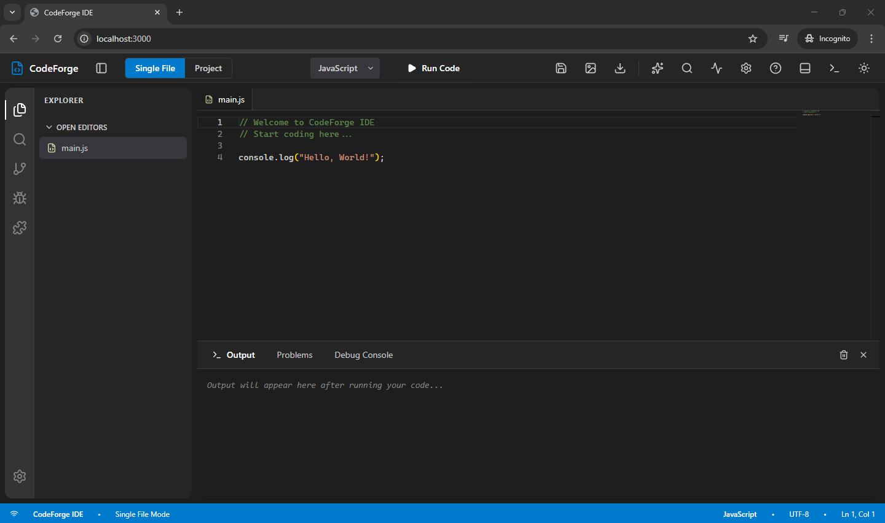
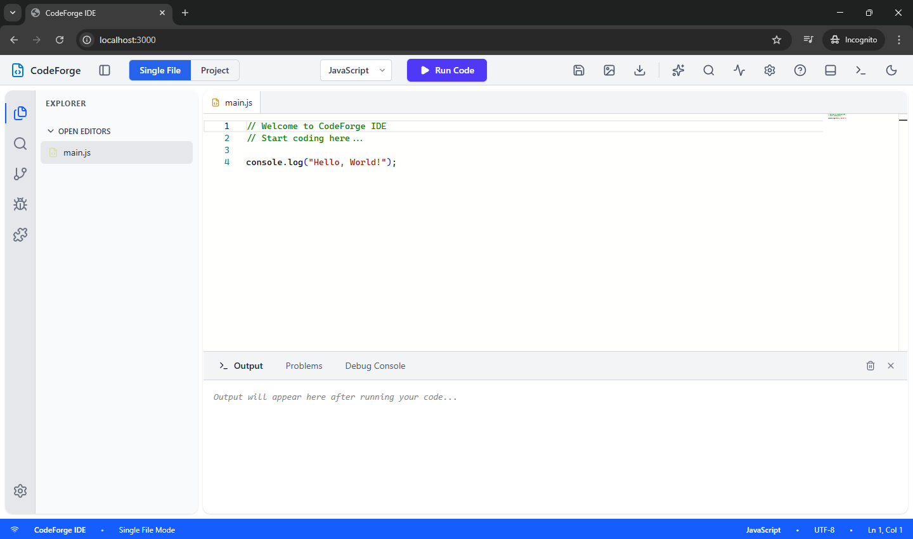

# CodeForge IDE 🚀

A fully-featured web-based Integrated Development Environment (IDE) with VS Code-like interface, multi-language code execution, and project management capabilities.


## ✨ Features

### Core Functionality
- 🎨 **VS Code-Inspired UI** - Dark/Light themes with accurate color schemes
- 📝 **Monaco Editor** - Same editor used in VS Code with IntelliSense
- ⚡ **Multi-Language Support** - Execute code in 18+ programming languages
- 🗂️ **Dual Mode** - Single file editing or full project management
- 💾 **Auto-Save** - Automatic file saving in project mode
- 📦 **ZIP Export** - Download entire projects as compressed archives

### Advanced Features
- 🎯 **Code Execution** - Sandboxed execution via Piston API (Docker)
- 🔗 **Gist Sharing** - Save and share code snippets with unique URLs
- 📸 **Code Screenshots** - Export beautiful code images (carbon.now.sh style)
- 🌳 **File System** - Full folder/file tree with nested structure
- 📑 **Multi-Tab Editor** - Open and edit multiple files simultaneously
- ⌨️ **Keyboard Shortcuts** - VS Code-compatible shortcuts

### Supported Languages
Python • JavaScript/Node.js • TypeScript • Java • C • C++ • C# • Go • Rust • Ruby • PHP • Swift • Kotlin • Bash • And more!

## 📸 Screenshots

### Welcome Screen


### Dark Mode (Default)


### Light Mode


## 🏗️ Architecture

```
┌─────────────┐     ┌──────────────┐     ┌─────────────┐
│   React     │────▶│   Express    │────▶│   Piston    │
│  Frontend   │     │   Backend    │     │  (Docker)   │
└─────────────┘     └──────────────┘     └─────────────┘
                           │
                           ▼
                    ┌──────────────┐
                    │   SQLite     │
                    │   Database   │
                    └──────────────┘
```

## 🚀 Quick Start

### Prerequisites
- Node.js 18+
- Docker & Docker Compose
- Git

### Installation

1. **Clone the repository**
```
git clone https://github.com/yourusername/codeforge-ide.git
cd codeforge-ide
```

2. **Start with Docker Compose** (Recommended)
```
docker-compose up -d
```

3. **Access the IDE**
```
Frontend: http://localhost:3000
Backend API: http://localhost:3001
Piston API: http://localhost:2000
```

### Manual Setup (Development)

**Backend:**
```
cd server
npm install
npm run dev
```

**Frontend:**
```
cd client
npm install
npm run dev
```

**Piston (Docker):**
```
docker run -d --name piston -p 2000:2000 --privileged ghcr.io/engineer-man/piston
```

## ⌨️ Keyboard Shortcuts

| Shortcut | Action |
|----------|--------|
| `Ctrl+S` / `Cmd+S` | Save current file |
| `Ctrl+Enter` / `Cmd+Enter` | Run code |
| `Ctrl+B` / `Cmd+B` | Toggle sidebar |
| ``Ctrl+` `` / ``Cmd+` `` | Toggle output panel |
| `Ctrl+Shift+P` / `Cmd+Shift+P` | Command palette |
| `Ctrl+F` / `Cmd+F` | Find in file |
| `Ctrl+/` / `Cmd+/` | Toggle comment |

Press `?` or click the Help icon for full list.

## 📁 Project Structure

```
codeforge-ide/
├── client/                 # React frontend
│   ├── src/
│   │   ├── components/     # React components
│   │   ├── hooks/          # Custom hooks
│   │   ├── store/          # Zustand state management
│   │   └── utils/          # Utility functions
│   ├── Dockerfile
│   └── package.json
│
├── server/                 # Express backend
│   ├── src/
│   │   ├── routes/         # API routes
│   │   ├── services/       # Business logic
│   │   └── db/             # Database setup
│   ├── Dockerfile
│   └── package.json
│
├── docker-compose.yml      # Multi-container setup
└── README.md
```

## 🛠️ Tech Stack

### Frontend
- **Framework:** React 18
- **Build Tool:** Vite
- **Editor:** Monaco Editor (@monaco-editor/react)
- **Styling:** TailwindCSS v4
- **State Management:** Zustand
- **Icons:** Lucide React
- **Screenshots:** html2canvas

### Backend
- **Runtime:** Node.js 18
- **Framework:** Express
- **Database:** SQLite (better-sqlite3)
- **HTTP Client:** Axios
- **Archive:** Archiver
- **ID Generation:** nanoid

### Infrastructure
- **Code Execution:** Piston API
- **Containerization:** Docker & Docker Compose
- **Web Server:** Nginx (production)

## 🔧 Configuration

### Environment Variables

**Backend (.env):**
```
PORT=3001
PISTON_URL=http://localhost:2000
NODE_ENV=development
```

**Frontend (.env):**
```
VITE_API_URL=http://localhost:3001
```

## 📚 API Documentation

### Endpoints

#### Code Execution
- `POST /api/execute` - Execute code
- `GET /api/execute/runtimes` - Get available languages

#### Gists
- `POST /api/gists` - Create gist
- `GET /api/gists/:id` - Get gist
- `PUT /api/gists/:id` - Update gist
- `GET /api/gists` - List gists

#### Projects
- `POST /api/projects` - Create project
- `GET /api/projects/:id` - Get project with files
- `POST /api/projects/:id/files` - Create file
- `PUT /api/projects/:id/files/:fileId` - Update file
- `DELETE /api/projects/:id/files/:fileId` - Delete file
- `GET /api/projects/:id/download` - Download as ZIP

## 🐛 Troubleshooting

### Piston not executing code
```
# Check if Piston is running
docker ps | grep piston

# View Piston logs
docker logs piston_api

# Restart Piston
docker restart piston_api
```

### Backend connection issues
```
# Check backend logs
cd server && npm run dev

# Verify health endpoint
curl http://localhost:3001/api/health
```

## 🤝 Contributing

Contributions are welcome! Please follow these steps:

1. Fork the repository
2. Create a feature branch (`git checkout -b feature/amazing-feature`)
3. Commit your changes (`git commit -m 'Add amazing feature'`)
4. Push to the branch (`git push origin feature/amazing-feature`)
5. Open a Pull Request

## 📄 License

This project is licensed under the MIT License - see the [LICENSE](LICENSE) file for details.

## 🙏 Acknowledgments

- [Monaco Editor](https://github.com/microsoft/monaco-editor) - Code editor
- [Piston](https://github.com/engineer-man/piston) - Code execution engine
- [VS Code](https://code.visualstudio.com/) - Design inspiration

## 📧 Contact

Lokesh Sinduluri - lokesh.sinduluri@gmail.com

Project Link: [https://github.com/yourusername/codeforge-ide](https://github.com/yourusername/codeforge-ide)

---

**Built with ❤️ by Lokesh Sinduluri**
